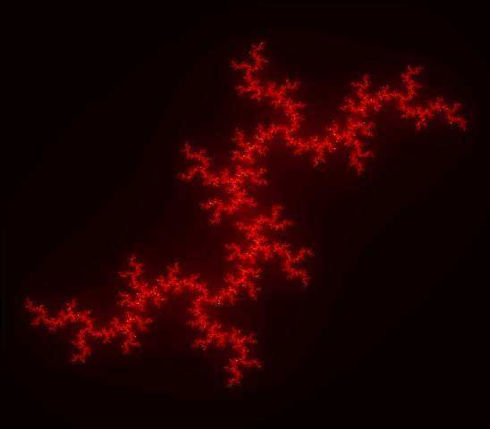

# Fractal Generation Project

A fractal generation tool to create beautiful, artistic pictures.

## Why the name *Fraken* ?

Fraken = Fractal + Kraken

*Release the Krakeeen!*

## Usage

You can see all options by:

`./release.py -h`

Generating default Mandelbrot fractal:

`./release.py`

Generating Julia fractal with *c=-0.8j*. Real and imaginary parts are given separately. '-w' shows image, '-o' saves image with given file name. e.g.

`./release.py -m julia -c 0 -0.8 -w -o julia_fractal.png`

Image shape can be arranged with -s option (width x height). e.g.

`./release.py -m julia -c 0 -0.8 -s 1000 800 -w -o julia_fractal.png`

Zoom in/out option is -z, threshold -t, iteration limit -l and coloring map -r. e.g.

`./release.py -m julia -c 0 -0.8 -t 2 -l 1000 -s 800 700 -z 0.7 -r hot -w -o julia_fractal.png`

Result:

### **TODO**
- Make fractals properly colored
- Optimize operations at lists, numpy matrices, opencv etc.
- Design fractal animations
- Add Theano version fractal generation
- Add GPU supported fractal generation
- Design a user-interface
- Research another fractal generation methods and apply them
